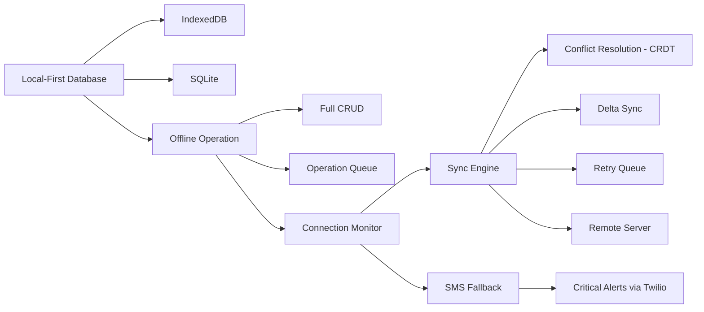

# 📡 Offline Justice Sync Engine — Works Without Internet


## The Problem

Connectivity gaps still exist — rural courthouses, low-income neighborhoods, crowded shelters. Justice tools that require internet exclude the most vulnerable users. When someone needs to file a form or check a deadline and there is no signal, the system fails them.

## The Solution

A local-first database that works offline, syncs when connection returns, and falls back to SMS for critical communications. Full functionality without internet — forms can be filled, documents reviewed, and deadlines tracked regardless of connectivity.



## Who This Helps

- **Rural court users** — access justice tools in areas with poor connectivity
- **Shelter residents** — use legal tools on shared or limited devices
- **Low-income communities** — work with unreliable or no internet access
- **Disaster-affected areas** — maintain case access during emergencies
- **Mobile court programs** — operate in the field without infrastructure

## Features

- **Local-first database** — IndexedDB (browser) + SQLite (mobile/desktop)
- **Full offline CRUD operations** — create, read, update, delete without internet
- **Automatic sync on reconnection** — seamless background synchronization
- **Conflict resolution (CRDT-based)** — deterministic merge without data loss
- **SMS fallback for critical notifications** — deadline alerts via text message
- **Bandwidth-optimized delta sync** — only transfer what changed
- **Connection quality monitoring** — adapt behavior to network conditions

## Quick Start

```bash
npm install @justice-os/offline-sync
```

```typescript
import { LocalStore, SyncEngine, ConnectionMonitor } from '@justice-os/offline-sync';

// Initialize the local-first database
const store = new LocalStore({ database: 'indexeddb', name: 'justice-app' });
await store.initialize();

// Work offline — all operations are local-first
await store.put('cases', { id: 'case-1', title: 'Housing Dispute', status: 'active' });
const myCase = await store.get('cases', 'case-1');

// Monitor connectivity
const monitor = new ConnectionMonitor();
monitor.on('online', () => console.log('Back online!'));
monitor.on('offline', () => console.log('Working offline'));

// Sync when connection returns
const sync = new SyncEngine({
  localStore: store,
  remoteUrl: 'https://api.justice-os.org/sync',
});

monitor.on('online', () => sync.syncAll());
```

## Roadmap

| Phase | Feature | Status |
|-------|---------|--------|
| 1 | LocalStore with IndexedDB/SQLite | 🟡 In Progress |
| 1 | Connection monitoring | 🟡 In Progress |
| 2 | Delta sync engine | 📋 Planned |
| 2 | CRDT-based conflict resolution | 📋 Planned |
| 3 | SMS fallback via Twilio | 📋 Planned |
| 3 | Bandwidth optimization | 📋 Planned |
| 4 | React components (SyncStatus, OfflineBanner) | 📋 Planned |
| 4 | Service Worker integration | 📋 Planned |

## Architecture

See [docs/architecture.md](docs/architecture.md) for system design and Mermaid diagrams.

## Data Model

See [docs/data-model.md](docs/data-model.md) for entity relationship diagrams.

## Contributing

See [CONTRIBUTING.md](CONTRIBUTING.md) for guidelines.

---

## Justice OS Ecosystem

This repository is part of the **Justice OS** open-source ecosystem — 32 interconnected projects building the infrastructure for accessible justice technology.

### Core System Layer
| Repository | Description |
|-----------|-------------|
| [justice-os](https://github.com/dougdevitre/justice-os) | Core modular platform — the foundation |
| [justice-api-gateway](https://github.com/dougdevitre/justice-api-gateway) | Interoperability layer for courts |
| [legal-identity-layer](https://github.com/dougdevitre/legal-identity-layer) | Universal legal identity and auth |
| [case-continuity-engine](https://github.com/dougdevitre/case-continuity-engine) | Never lose case history across systems |
| [offline-justice-sync](https://github.com/dougdevitre/offline-justice-sync) | Works without internet — local-first sync |

### User Experience Layer
| Repository | Description |
|-----------|-------------|
| [justice-navigator](https://github.com/dougdevitre/justice-navigator) | Google Maps for legal problems |
| [mobile-court-access](https://github.com/dougdevitre/mobile-court-access) | Mobile-first court access kit |
| [cognitive-load-ui](https://github.com/dougdevitre/cognitive-load-ui) | Design system for stressed users |
| [multilingual-justice](https://github.com/dougdevitre/multilingual-justice) | Real-time legal translation |
| [voice-legal-interface](https://github.com/dougdevitre/voice-legal-interface) | Justice without reading or typing |
| [legal-plain-language](https://github.com/dougdevitre/legal-plain-language) | Turn legalese into human language |

### AI + Intelligence Layer
| Repository | Description |
|-----------|-------------|
| [vetted-legal-ai](https://github.com/dougdevitre/vetted-legal-ai) | RAG engine with citation validation |
| [justice-knowledge-graph](https://github.com/dougdevitre/justice-knowledge-graph) | Open data layer for laws and procedures |
| [legal-ai-guardrails](https://github.com/dougdevitre/legal-ai-guardrails) | AI safety SDK for justice use |
| [emotional-intelligence-ai](https://github.com/dougdevitre/emotional-intelligence-ai) | Reduce conflict, improve outcomes |
| [ai-reasoning-engine](https://github.com/dougdevitre/ai-reasoning-engine) | Show your work for AI decisions |

### Infrastructure + Trust Layer
| Repository | Description |
|-----------|-------------|
| [evidence-vault](https://github.com/dougdevitre/evidence-vault) | Privacy-first secure evidence storage |
| [court-notification-engine](https://github.com/dougdevitre/court-notification-engine) | Smart deadline and hearing alerts |
| [justice-analytics](https://github.com/dougdevitre/justice-analytics) | Bias detection and disparity dashboards |
| [evidence-timeline](https://github.com/dougdevitre/evidence-timeline) | Evidence timeline builder |

### Tools + Automation Layer
| Repository | Description |
|-----------|-------------|
| [court-doc-engine](https://github.com/dougdevitre/court-doc-engine) | TurboTax for legal filings |
| [justice-workflow-engine](https://github.com/dougdevitre/justice-workflow-engine) | Zapier for legal processes |
| [pro-se-toolkit](https://github.com/dougdevitre/pro-se-toolkit) | Self-represented litigant tools |
| [justice-score-engine](https://github.com/dougdevitre/justice-score-engine) | Access-to-justice measurement |
| [justice-app-generator](https://github.com/dougdevitre/justice-app-generator) | No-code builder for justice tools |

### Quality + Testing Layer
| Repository | Description |
|-----------|-------------|
| [justice-persona-simulator](https://github.com/dougdevitre/justice-persona-simulator) | Test products against real human realities |
| [justice-experiment-lab](https://github.com/dougdevitre/justice-experiment-lab) | A/B testing for justice outcomes |

### Adoption Layer
| Repository | Description |
|-----------|-------------|
| [digital-literacy-sim](https://github.com/dougdevitre/digital-literacy-sim) | Digital literacy simulator |
| [legal-resource-discovery](https://github.com/dougdevitre/legal-resource-discovery) | Find the right help instantly |
| [court-simulation-sandbox](https://github.com/dougdevitre/court-simulation-sandbox) | Practice before the real thing |
| [justice-components](https://github.com/dougdevitre/justice-components) | Reusable component library |
| [justice-dev-starter-kit](https://github.com/dougdevitre/justice-dev-starter-kit) | Ultimate boilerplate for justice tech builders |

> Built with purpose. Open by design. Justice for all.
