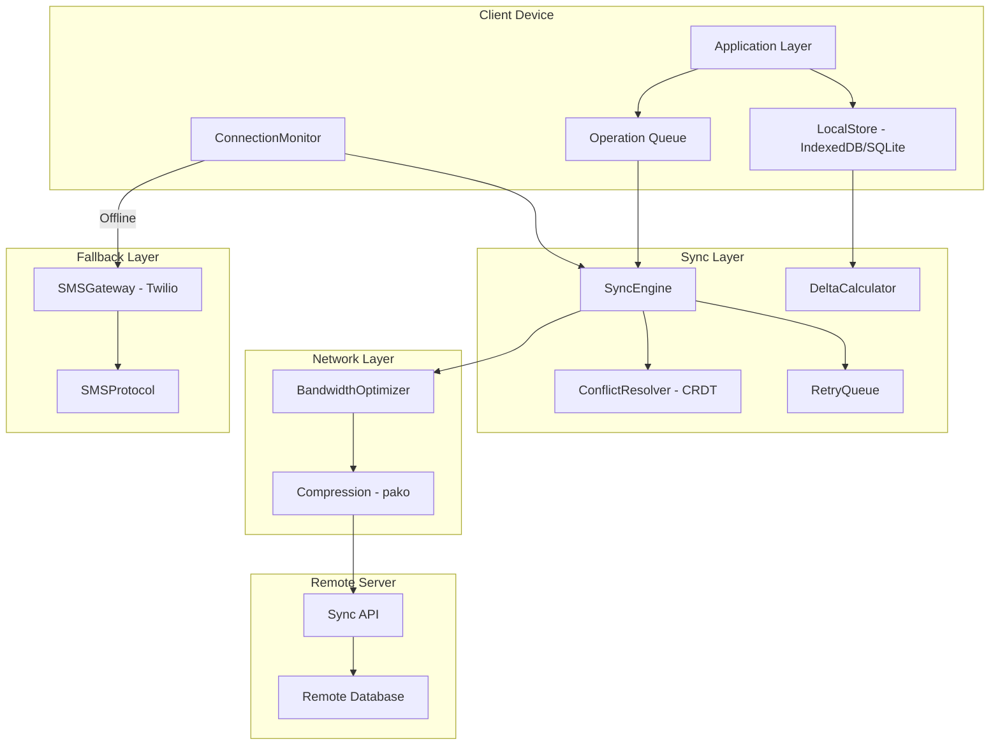
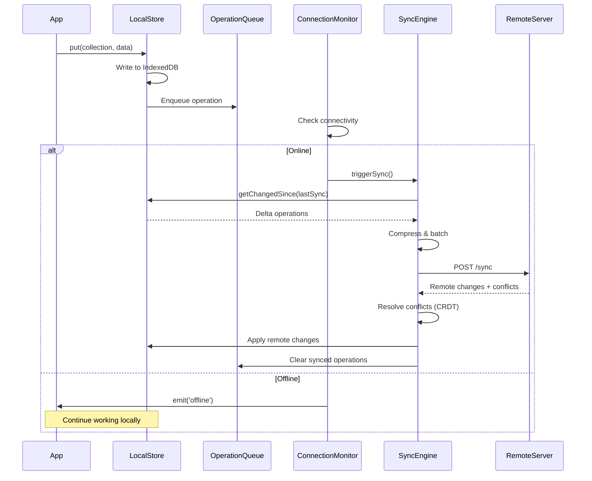
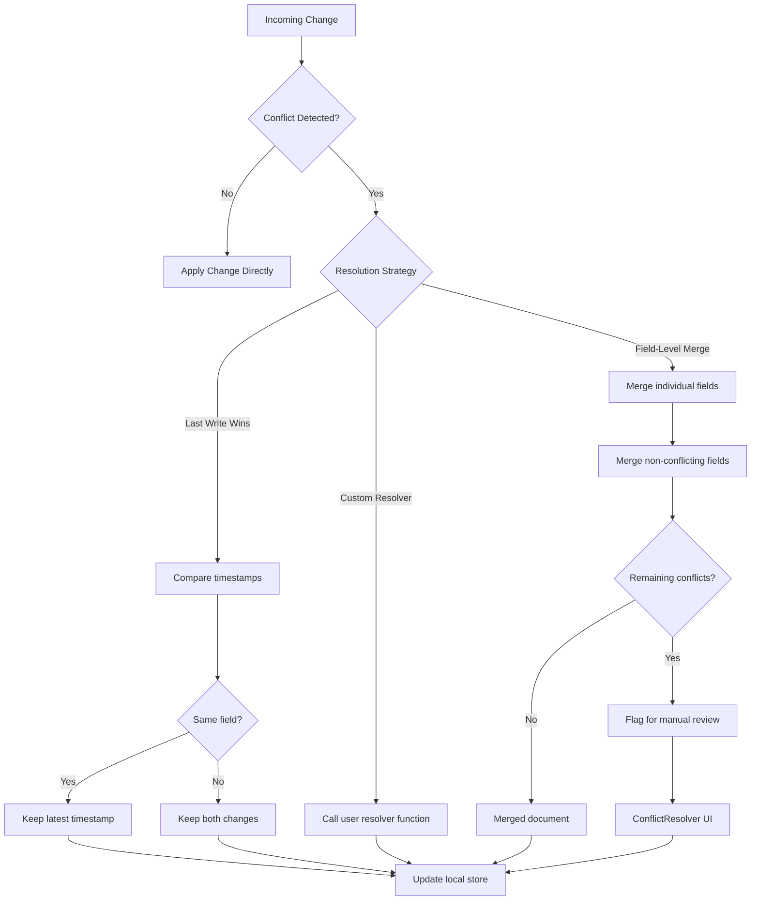
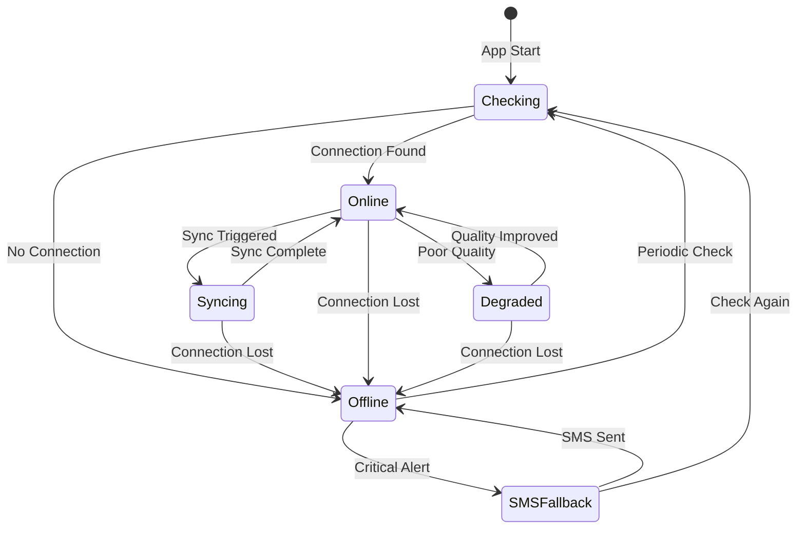
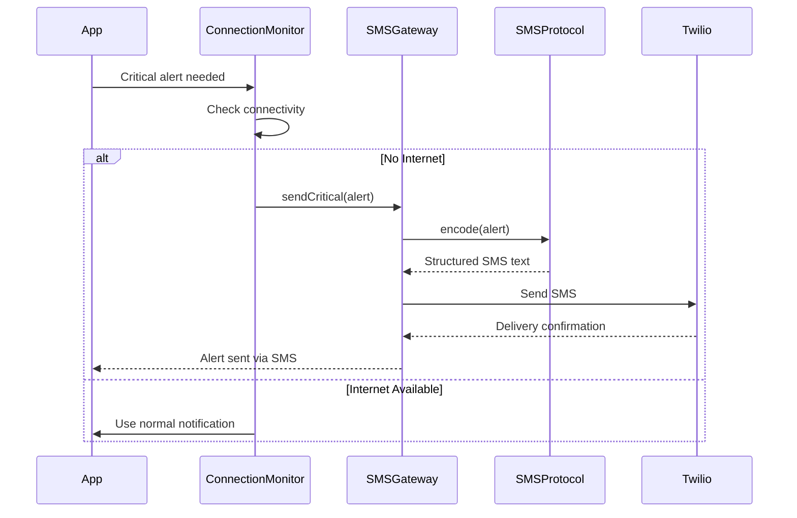

# Architecture — Offline Justice Sync Engine

## System Overview

```mermaid
graph TB
    subgraph Client["Client Device"]
        A[Application Layer]
        B[LocalStore - IndexedDB/SQLite]
        C[Operation Queue]
        D[ConnectionMonitor]
    end

    subgraph Sync["Sync Layer"]
        E[SyncEngine]
        F[DeltaCalculator]
        G[ConflictResolver - CRDT]
        H[RetryQueue]
    end

    subgraph Network["Network Layer"]
        I[BandwidthOptimizer]
        J[Compression - pako]
    end

    subgraph Fallback["Fallback Layer"]
        K[SMSGateway - Twilio]
        L[SMSProtocol]
    end

    subgraph Remote["Remote Server"]
        M[Sync API]
        N[Remote Database]
    end

    A --> B
    A --> C
    D --> E
    B --> F
    C --> E
    E --> G
    E --> H
    E --> I
    I --> J
    J --> M
    M --> N
    D -->|Offline| K
    K --> L
```

## Sync Flow

```mermaid
sequenceDiagram
    participant App
    participant Store as LocalStore
    participant Queue as OperationQueue
    participant Monitor as ConnectionMonitor
    participant Sync as SyncEngine
    participant Remote as RemoteServer

    App->>Store: put(collection, data)
    Store->>Store: Write to IndexedDB
    Store->>Queue: Enqueue operation

    Monitor->>Monitor: Check connectivity
    alt Online
        Monitor->>Sync: triggerSync()
        Sync->>Store: getChangedSince(lastSync)
        Store-->>Sync: Delta operations
        Sync->>Sync: Compress & batch
        Sync->>Remote: POST /sync
        Remote-->>Sync: Remote changes + conflicts
        Sync->>Sync: Resolve conflicts (CRDT)
        Sync->>Store: Apply remote changes
        Sync->>Queue: Clear synced operations
    else Offline
        Monitor->>App: emit('offline')
        Note over App,Store: Continue working locally
    end
```

## Conflict Resolution (CRDT)

```mermaid
flowchart TD
    A[Incoming Change] --> B{Conflict Detected?}
    B -->|No| C[Apply Change Directly]
    B -->|Yes| D{Resolution Strategy}
    D -->|Last Write Wins| E[Compare timestamps]
    D -->|Field-Level Merge| F[Merge individual fields]
    D -->|Custom Resolver| G[Call user resolver function]
    E --> H{Same field?}
    H -->|Yes| I[Keep latest timestamp]
    H -->|No| J[Keep both changes]
    F --> K[Merge non-conflicting fields]
    K --> L{Remaining conflicts?}
    L -->|Yes| M[Flag for manual review]
    L -->|No| N[Merged document]
    I & J & G & N --> O[Update local store]
    M --> P[ConflictResolver UI]
    P --> O
```

## Connection State Machine

```mermaid
stateDiagram-v2
    [*] --> Checking: App Start
    Checking --> Online: Connection Found
    Checking --> Offline: No Connection

    Online --> Syncing: Sync Triggered
    Syncing --> Online: Sync Complete
    Syncing --> Offline: Connection Lost

    Online --> Offline: Connection Lost
    Offline --> Checking: Periodic Check
    Offline --> SMSFallback: Critical Alert

    SMSFallback --> Offline: SMS Sent
    SMSFallback --> Checking: Check Again

    Online --> Degraded: Poor Quality
    Degraded --> Online: Quality Improved
    Degraded --> Offline: Connection Lost
```

## SMS Fallback Protocol

```mermaid
sequenceDiagram
    participant App
    participant Monitor as ConnectionMonitor
    participant Gateway as SMSGateway
    participant Protocol as SMSProtocol
    participant Twilio

    App->>Monitor: Critical alert needed
    Monitor->>Monitor: Check connectivity
    alt No Internet
        Monitor->>Gateway: sendCritical(alert)
        Gateway->>Protocol: encode(alert)
        Protocol-->>Gateway: Structured SMS text
        Gateway->>Twilio: Send SMS
        Twilio-->>Gateway: Delivery confirmation
        Gateway-->>App: Alert sent via SMS
    else Internet Available
        Monitor->>App: Use normal notification
    end
```
