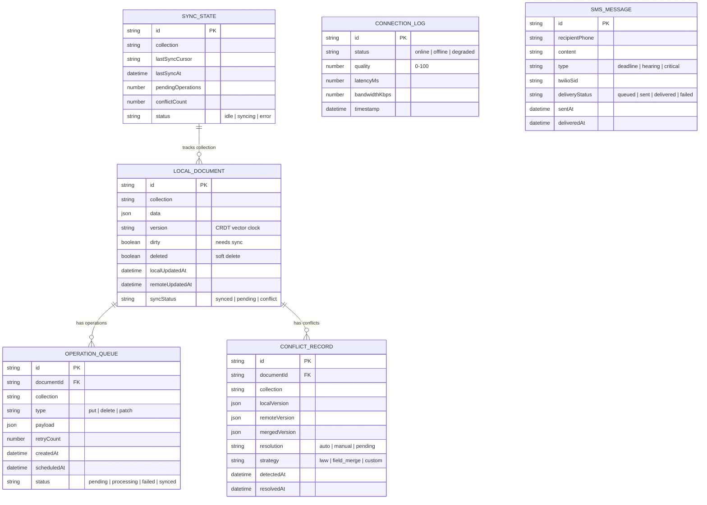

# Data Model — Offline Justice Sync Engine

## Entity Relationship Diagram

## Key Entities

### LocalDocument
A document stored in the local-first database. Contains the data, version information (CRDT vector clock), sync status, and timestamps for both local and remote updates.

### OperationQueue
A queue of pending operations that need to be synced with the remote server. Operations are processed in order with retry logic and exponential backoff.

### SyncState
Tracks the synchronization state for each collection. Includes the last sync cursor, pending operation count, and current sync status.

### ConflictRecord
Records detected conflicts between local and remote versions of a document. Includes both versions, the merge strategy used, and resolution status.

### ConnectionLog
Historical record of connection quality measurements. Used for analytics and adaptive sync behavior.

### SMSMessage
Tracks SMS messages sent through the Twilio fallback. Includes delivery status tracking for critical alerts.
